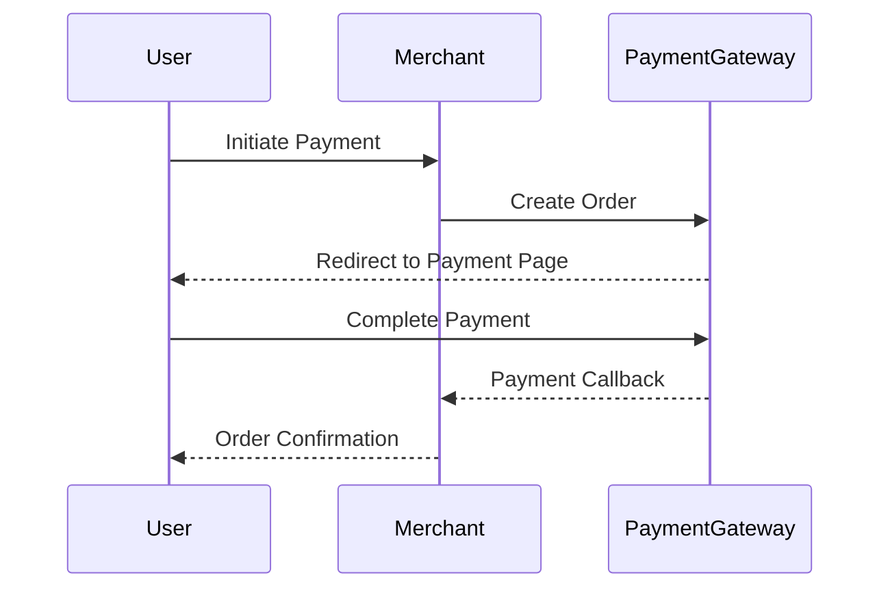

# FakePay payment gateway 💳


A secure and modern payment gateway solution with merchant integration examples. Built with Flask and HMAC security.

## It works just like a normal banking api would work so its perfect for development


## Usage (no installation needed)
- Download the fakepay.py from the client folder to your project
- use it as it's showed in the package_example.py


## Features ✨

- **Secure Payment Processing**
  - HMAC-SHA256 signature verification
  - Session timeout handling
  - Anti-tamper protection
- **Merchant Integration**
  - Simple REST API
  - Multiple currency support
  - Customizable callback URLs
- **Modern UI**
  - Responsive payment page
  - Animated status indicators
- **Developer Friendly**
  - Example merchant implementations
  - Comprehensive error handling
  - Easy-to-customize templates

## Installation 🚀

### Requirements
- Python 3.8+
- Flask 2.0+
- Requests library

```bash
pip install flask requests
```

### Environment Setup
```bash
export FLASK_SECRET_KEY="your_secret_key"
export MERCHANT_SECRET="merchant_secret_token"
```

## Usage 📖

### Start Payment Gateway Server
```bash
python payment_gateway.py
```

### Run Merchant Example
```bash
python merchant_client.py
```

### Run Demo Web Application
```bash
python demo_webapp.py
```

## API Documentation 📚

### Create Payment Order
**Endpoint**: `POST /api/payment/order/make`

**Request Example**:
```json
{
  "merchant": "ExampleStore",
  "orderRef": 123456789,
  "customerEmail": "user@example.com",
  "customerName": "John Doe",
  "currency": "USD",
  "total": 99.99,
  "methods": ["CARD"],
  "url": {
    "success": "https://example.com/success",
    "fail": "https://example.com/fail",
    "cancel": "https://example.com/cancel"
  },
  "merchant_secret" : "EXAMPLE_SECRET"
}
```

### Check Payment Status
**Endpoint**: `POST /api/payment/order/status`

**Request Example**:
```json
{
  "merchant": "ExampleStore",
  "merchant_secret" : "EXAMPLE_SECRET"
  "transactionid" : 00000
}
```

**Response States**:
- `pending` - Payment in progress
- `done` - Successful payment
- `timedout` - Session expired
- `cancelled` - User cancelled

## Security 🔒

- **HMAC-SHA256 Signature Verification**
- **HTTPS Recommended** (Enable in config)
- **Secret Key Protection**
- **Input Validation**
- **Session Timeout Protection**

## Example Flow 🌐

1. User initiates payment through merchant site
2. Merchant server creates payment order
3. User redirected to payment gateway
4. Payment processed or cancelled
5. Callback sent to merchant server
6. Merchant updates order status



## Customization 🎨

Modify the included templates to match your brand:

1. **Payment Page** (`payment.html`)
2. **Timeout Page** (`timeout.html`)
3. **Loading Animation** (`loading.html`)

```html
<!-- Example template customization -->
<div class="payment-brand">
  
  {{ merchant }}
</div>
```

## Contributing 🤝

Contributions welcome! Please follow these steps:
1. Fork the repository
2. Create your feature branch
3. Commit your changes
4. Push to the branch
5. Open a pull request

## License 📄

Ez a projekt a módosított GNU General Public License (GPL) v3 licenc alatt áll. A licenc teljes szövege megtalálható a LICENSE fájlban.

Fontos: Ha módosítod a programot, köteles vagy a módosított változatot nyilvánosan hozzáférhetővé tenni, a módosított GPL licenc 5(e) szakaszában foglaltak szerint.

---

**Note**: This is a demonstration system. For production use:
- Enable HTTPS
- Implement proper secret management
- Add database persistence
- Add additional security measures
